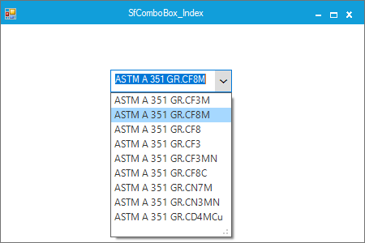

# How to Select an Item by Index in WinForms SfComboBox
This example demonstrates how to select an item programmatically by index in the Syncfusion WinForms SfComboBox control. The SfComboBox supports both index-based selection and object-based selection, making it flexible for scenarios like applying default selections, loading saved preferences, or responding to application logic.

## Why This Is Useful
- **Dynamic Selection**: Automatically select items based on conditions.
- **Improved UX**: Pre-load user preferences or defaults.
- **Flexibility**: Choose items by index or by object reference.

## Key Properties
- **SelectedIndex**: Sets or gets the zero-based index of the selected item.
- **SelectedItem**: Sets or gets the actual object from the data source.

## Example Code
```C#

public Form1()
{
    InitializeComponent();

    // Sample data
    List<State> list = GetData();

    // Create and configure SfComboBox
    SfComboBox sfComboBox1 = new SfComboBox
    {
        Size = new Size(150, 28),
        Location = new Point(138, 56),
        DataSource = list,
        DisplayMember = "DispValue",
        ValueMember = "SfValue",
        ComboBoxMode = Syncfusion.WinForms.ListView.Enums.ComboBoxMode.SingleSelection,
        AutoCompleteMode = AutoCompleteMode.SuggestAppend,
        AutoCompleteSuggestMode = Syncfusion.WinForms.ListView.Enums.AutoCompleteSuggestMode.Contains,
        MaxDropDownItems = 10
    };

    // Select the item based on index (second item)
    sfComboBox1.SelectedIndex = 1;

    // Select the item based on object
    sfComboBox1.SelectedItem = list[1];

    this.Controls.Add(sfComboBox1);
}

private List<State> GetData()
{
    return new List<State>
    {
        new State { DispValue = "California", SfValue = 1 },
        new State { DispValue = "Texas", SfValue = 2 },
        new State { DispValue = "Florida", SfValue = 3 }
    };
}

public class State
{
    public string DispValue { get; set; }
    public int SfValue { get; set; }
}
```

## Notes
- Use SelectedIndex for index-based selection (zero-based).
- Use SelectedItem for object-based selection.
- Ensure the data source is bound before setting these properties.

## Reference
For more details, refer to the official Syncfusion Knowledge Base: https://support.syncfusion.com/kb/article/10653/how-to-select-the-item-through-index-in-winforms-sfcombobox

## Output


